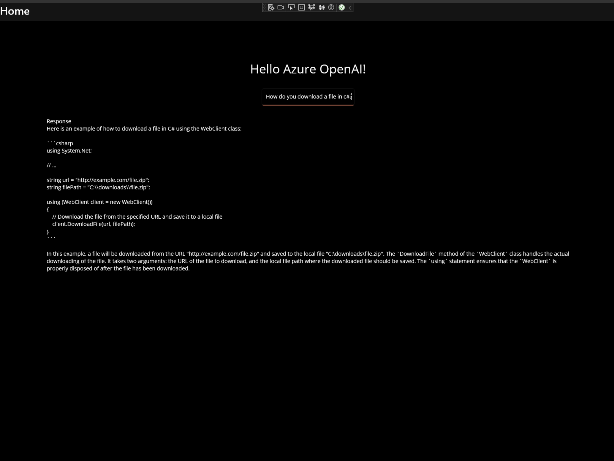

# MauiAzureOpenAI

This project shows you how to use the Azure.AI.OpenAI client library to generate an OpenAI Chatbot response to a prompt.

## Building

`dotnet build MauiAzureOpenAI.sln`

## Screenshots

